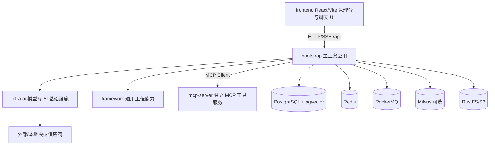
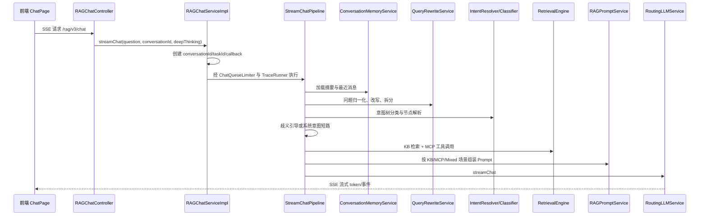
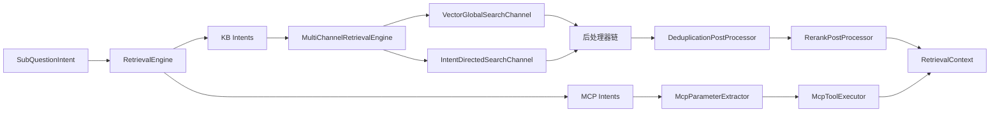
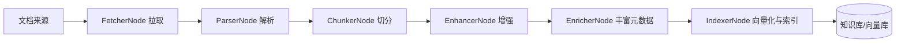
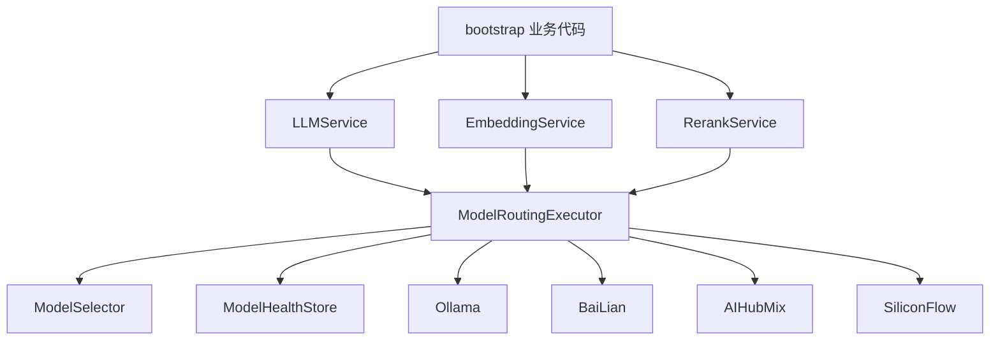

# Ragent AI 系统框架

本文面向源码学习，目标是先建立全局地图，再按链路深入关键类。项目是一个 Java 17 + Spring Boot 3 + Maven 多模块后端，配套 React 18 + Vite + TypeScript 前端的企业级 Agentic RAG 平台。

## 1. 总体定位

Ragent AI 覆盖从文档入库到智能问答的完整闭环：

- 文档侧：知识库管理、文档上传、解析、切分、增强、向量化、索引入库、定时刷新。
- 问答侧：会话管理、记忆加载、问题改写拆分、意图识别、知识库检索、MCP 工具调用、Prompt 组装、模型流式输出。
- 工程侧：模型路由与熔断降级、SSE 流式响应、分布式排队限流、RAG Trace、用户认证、后台管理。

## 2. 模块分层



### 后端 Maven 模块

| 模块 | 职责 | 重点源码 |
| --- | --- | --- |
| `bootstrap` | 主 Spring Boot 应用，承载 RAG、知识库、入库流水线、用户、后台等业务 | `bootstrap/src/main/java/com/nageoffer/ai/ragent` |
| `framework` | 通用 Web、异常、响应、数据库、Redis、MQ、上下文、Trace、SSE 能力 | `framework/src/main/java/com/nageoffer/ai/ragent/framework` |
| `infra-ai` | 模型供应商适配、模型路由、Embedding、Rerank、Token、HTTP 基础设施 | `infra-ai/src/main/java/com/nageoffer/ai/ragent/infra` |
| `mcp-server` | 独立 MCP Server，暴露可被主应用调用的业务工具 | `mcp-server/src/main/java/com/nageoffer/ai/ragent/mcp` |

### 前端目录

| 目录 | 职责 |
| --- | --- |
| `frontend/src/pages` | 页面：登录、聊天、管理后台、知识库、意图树、入库、Trace、设置、用户等 |
| `frontend/src/services` | API 调用封装 |
| `frontend/src/stores` | Zustand 状态：认证、聊天、主题 |
| `frontend/src/components` | 布局、聊天、后台、通用 UI 组件 |
| `frontend/src/router.tsx` | 路由与登录/管理员守卫 |

## 3. 运行时边界

后端主应用入口是 `bootstrap/src/main/java/com/nageoffer/ai/ragent/RagentApplication.java`。默认配置见 `bootstrap/src/main/resources/application.yaml`：

- 主服务端口：`9090`
- API 上下文路径：`/api/ragent`
- MCP Server：`http://localhost:9099`
- 向量存储：`rag.vector.type` 支持 `pg` 或 `milvus`
- PostgreSQL：业务表与 pgvector 向量表
- Redis：登录态、缓存、排队限流、意图树缓存等
- RocketMQ：消息/反馈等异步场景
- RustFS/S3：文档文件存储
- AI Provider：`ollama`、`bailian`、`aihubmix`、`siliconflow`

前端通过 Vite 启动，默认由代理或 `VITE_API_BASE_URL` 连接后端。统一 Axios 实例在 `frontend/src/services/api.ts`，会自动附加 `Authorization`，并处理统一响应体 `{ code, message, data }`。

## 4. 后端业务域

`bootstrap` 下按业务域组织：

| 包 | 业务域 |
| --- | --- |
| `rag` | RAG 问答主链路、会话、检索、意图、Prompt、MCP Client、Trace、限流、系统设置 |
| `knowledge` | 知识库、文档、分块、文档调度刷新、文件预览/下载 |
| `ingestion` | 文档入库 Pipeline：Fetcher、Parser、Chunker、Enhancer、Enricher、Indexer |
| `core` | 文档解析、文本清洗、切分策略、Chunk Embedding 等底层能力 |
| `user` | 登录、用户、角色、Sa-Token 集成、用户上下文 |
| `admin` | 后台仪表板统计 |

## 5. RAG 问答主链路

入口接口是 `GET /rag/v3/chat`，控制器在 `RAGChatController`，业务入口是 `RAGChatServiceImpl`，核心编排在 `StreamChatPipeline`。



关键类：

- `RAGChatServiceImpl`：创建会话 ID、任务 ID、SSE callback，接入排队限流与 Trace。
- `StreamChatPipeline`：主流程编排，按阶段处理记忆、改写、意图、检索、Prompt、流式输出。
- `DefaultConversationMemoryService`：并行加载摘要和历史消息，写入后触发摘要压缩。
- `MultiQuestionRewriteService`：基于术语映射和 LLM 实现问题改写、多问句拆分。
- `DefaultIntentClassifier`：加载意图树，调用 LLM 对叶子意图打分。
- `IntentGuidanceService`：置信度不足或歧义时返回澄清提示。
- `RetrievalEngine`：整合知识库检索和 MCP 工具结果，生成上下文。
- `RAGPromptService`：根据 KB-only、MCP-only、Mixed 场景选择模板并构造消息。
- `RoutingLLMService`：多模型候选路由、流式首包探测、失败切换。

## 6. 检索系统

检索入口是 `RetrievalEngine.retrieve`。它先区分 KB 意图和 MCP 意图：

- KB 意图进入 `MultiChannelRetrievalEngine`
- MCP 意图通过 `McpToolRegistry` 查找工具，再由 `McpParameterExtractor` 提参并调用
- 最终由 `ContextFormatter` 格式化为 Prompt 可用上下文



检索扩展点：

- 新增检索通道：实现 `SearchChannel`。
- 新增后处理器：实现 `SearchResultPostProcessor`。
- 新增向量存储：实现 `VectorStoreService`、`VectorStoreAdmin`、`RetrieverService`。
- 当前实现：`PgVectorStoreService`、`MilvusVectorStoreService`、`PgRetrieverService`、`MilvusRetrieverService`。

## 7. 文档入库链路

入库能力分为两套入口：

- `knowledge`：面向知识库文档的上传、分块、管理、调度刷新。
- `ingestion`：面向可编排 Pipeline 的通用入库任务。

`IngestionEngine` 基于数据库中的节点定义执行链式流水线，节点通过 `IngestionNode` 接口注册。



节点说明：

| 节点 | 作用 |
| --- | --- |
| `FetcherNode` | 从本地、HTTP、飞书、S3 等来源获取文件或内容 |
| `ParserNode` | 使用解析器将 PDF、DOC、Markdown 等转为结构化文本 |
| `ChunkerNode` | 按固定长度或结构感知策略切分 Chunk |
| `EnhancerNode` | 对内容做增强处理 |
| `EnricherNode` | 补充摘要、关键词、元数据等 |
| `IndexerNode` | 调用 Embedding 并写入向量存储 |

知识库相关关键类：

- `KnowledgeBaseServiceImpl`：知识库 CRUD。
- `KnowledgeDocumentServiceImpl`：文档上传、解析、分块、预览/下载。
- `KnowledgeChunkServiceImpl`：Chunk 管理。
- `KnowledgeDocumentScheduleJob`：定时扫描需要刷新的文档。
- `ScheduleRefreshProcessor`：执行调度刷新。

## 8. 模型基础设施

`infra-ai` 屏蔽模型供应商差异，上层业务只依赖 `LLMService`、`EmbeddingService`、`RerankService`。



核心设计：

- `ModelSelector`：根据能力和配置选择候选模型。
- `ModelRoutingExecutor`：按候选顺序执行，失败后 fallback 到下一个。
- `ModelHealthStore`：记录模型健康状态，失败达到阈值后进入熔断窗口。
- `RoutingLLMService`：聊天与流式聊天的路由实现。
- `LlmFirstPacketProbe` / `ProbeStreamBridge`：流式首包探测，避免坏模型长时间占用请求。
- `AbstractOpenAIStyleChatClient` / `AbstractOpenAIStyleEmbeddingClient`：复用 OpenAI 兼容协议实现。

## 9. MCP 集成

主应用作为 MCP Client，配置在 `rag.mcp.servers`。默认连接 `http://localhost:9099`。

`mcp-server` 是独立 Spring Boot 服务：

- 端口：`9099`
- MCP Servlet：`/mcp`
- 配置类：`McpServerConfig`
- 示例工具：`WeatherMcpExecutor`、`TicketMcpExecutor`、`SalesMcpExecutor`

主应用侧核心类：

- `McpClientAutoConfiguration`：创建 MCP Client。
- `DefaultMcpToolRegistry`：注册 MCP 工具执行器。
- `McpClientToolExecutor`：调用远程 MCP 工具。
- `LLMMcpParameterExtractor`：根据用户问题和工具 schema 让 LLM 提取参数。

## 10. 数据模型

PostgreSQL 建表脚本在 `resources/database/schema_pg.sql`。核心表按领域可分为：

| 领域 | 表 |
| --- | --- |
| 用户认证 | `t_user` |
| 会话记忆 | `t_conversation`、`t_message`、`t_conversation_summary`、`t_message_feedback` |
| 知识库 | `t_knowledge_base`、`t_knowledge_document`、`t_knowledge_chunk`、`t_knowledge_document_chunk_log`、`t_knowledge_vector` |
| 文档调度 | `t_knowledge_document_schedule`、`t_knowledge_document_schedule_exec` |
| 意图与改写 | `t_intent_node`、`t_query_term_mapping` |
| Trace | `t_rag_trace_run`、`t_rag_trace_node` |
| 入库 Pipeline | `t_ingestion_pipeline`、`t_ingestion_pipeline_node`、`t_ingestion_task`、`t_ingestion_task_node` |
| 示例问题 | `t_sample_question` |

其中 `t_knowledge_vector` 是 pgvector 场景的向量表；如果使用 Milvus，则向量写入 Milvus，业务元数据仍在 PostgreSQL。

## 11. API 分组

默认完整路径需要加上上下文路径 `/api/ragent`。

| 分组 | 代表接口 | 控制器 |
| --- | --- | --- |
| 登录认证 | `/auth/login`、`/auth/logout` | `AuthController` |
| 用户 | `/user/me`、`/users` | `UserController` |
| 聊天 | `/rag/v3/chat`、`/rag/v3/stop` | `RAGChatController` |
| 会话 | `/conversations` | `ConversationController` |
| 反馈 | `/conversations/messages/{messageId}/feedback` | `MessageFeedbackController` |
| 示例问题 | `/rag/sample-questions`、`/sample-questions` | `SampleQuestionController` |
| 知识库 | `/knowledge-base` | `KnowledgeBaseController` |
| 文档 | `/knowledge-base/{kb-id}/docs/upload` 等 | `KnowledgeDocumentController` |
| Chunk | `/knowledge-base/docs/{doc-id}/chunks` | `KnowledgeChunkController` |
| 意图树 | `/intent-tree`、`/intent-tree/trees` | `IntentTreeController` |
| 术语映射 | `/mappings` | `QueryTermMappingController` |
| 入库任务 | `/ingestion/tasks` | `IngestionTaskController` |
| 入库流水线 | `/ingestion/pipelines` | `IngestionPipelineController` |
| Trace | `/rag/traces/runs` | `RagTraceController` |
| 设置 | `/rag/settings` | `RAGSettingsController` |
| 仪表盘 | `/admin/dashboard/*` | `DashboardController` |

## 12. 前端页面框架

前端路由在 `frontend/src/router.tsx`：

```mermaid
flowchart TB
    ROOT[/ /] --> LOGIN[/login]
    ROOT --> CHAT[/chat 或 /chat/:sessionId]
    ROOT --> ADMIN[/admin]
    ADMIN --> DASH[dashboard]
    ADMIN --> KB[knowledge]
    ADMIN --> INTENT[intent-tree / intent-list]
    ADMIN --> ING[ingestion]
    ADMIN --> TRACE[traces]
    ADMIN --> SET[settings]
    ADMIN --> SAMPLE[sample-questions]
    ADMIN --> MAP[mappings]
    ADMIN --> USERS[users]
```

前端权限：

- `RequireAuth`：未登录跳转 `/login`。
- `RequireAdmin`：非管理员跳转 `/chat`。
- 登录态存储在 `authStore` 与本地 storage 中。

主要页面与后端对应：

| 页面 | 后端域 |
| --- | --- |
| `ChatPage` | `rag` 聊天、会话、SSE |
| `KnowledgeListPage` / `KnowledgeDocumentsPage` / `KnowledgeChunksPage` | `knowledge` |
| `IntentTreePage` / `IntentListPage` / `IntentEditPage` | `rag` 意图树 |
| `IngestionPage` | `ingestion` |
| `RagTracePage` / `RagTraceDetailPage` | `rag` Trace |
| `SystemSettingsPage` | `rag` 设置与模型配置展示 |
| `UserListPage` | `user` |

## 13. 横切能力

| 能力 | 实现位置 | 作用 |
| --- | --- | --- |
| 统一响应 | `framework.web.Results` | API 返回统一结构 |
| 全局异常 | `framework.web.GlobalExceptionHandler` | 统一异常到错误码/消息 |
| SSE 封装 | `framework.web.SseEmitterSender` | 线程安全发送流式事件 |
| 用户上下文 | `framework.context.UserContext`、`user.config.UserContextInterceptor` | 当前用户跨层获取 |
| 认证鉴权 | `SaTokenConfig`、`SaTokenStpInterfaceImpl` | 登录、角色、接口拦截 |
| Trace | `framework.trace`、`rag.aop.RagTraceAspect` | 记录 RAG 节点耗时、输入输出、异常 |
| 限流排队 | `rag.service.ratelimit`、`queue_claim_atomic.lua` | 控制聊天并发，SSE 推送排队状态 |
| 线程池 | `ThreadPoolExecutorConfig` | RAG 检索、MCP、模型流式、记忆摘要等隔离执行 |
| MQ | `framework.mq` | RocketMQ 生产者适配 |
| 数据库 | `framework.config.DataBaseConfiguration` | MyBatis Plus 与元字段填充 |

## 14. 源码阅读路线

建议按下面顺序读，避免一开始陷入细节：

1. 项目启动与配置  
   读 `pom.xml`、`bootstrap/pom.xml`、`application.yaml`、`RagentApplication`，理解模块依赖和运行时组件。

2. 聊天主链路  
   从 `RAGChatController` 到 `RAGChatServiceImpl`，再进入 `StreamChatPipeline`，先看清一次用户提问经过哪些阶段。

3. 检索与 Prompt  
   读 `RetrievalEngine`、`MultiChannelRetrievalEngine`、两个 `SearchChannel`、两个 `PostProcessor`、`RAGPromptService`。

4. 模型路由  
   读 `RoutingLLMService`、`ModelRoutingExecutor`、`ModelSelector`、`ModelHealthStore`、各 Provider Client。

5. 文档入库  
   读 `KnowledgeDocumentServiceImpl`、`IngestionEngine`、`IngestionNode` 六个实现、`ChunkEmbeddingService`。

6. 意图体系与 MCP  
   读 `DefaultIntentClassifier`、`IntentResolver`、`IntentTreeCacheManager`、`McpClientAutoConfiguration`、`McpClientToolExecutor`。

7. 工程化能力  
   读 `RagTraceAspect`、`ChatQueueLimiter`、`ThreadPoolExecutorConfig`、`GlobalExceptionHandler`、`SaTokenConfig`。

8. 前端联动  
   读 `router.tsx`、`ChatPage`、`useChat`、`useStreamResponse`、`services/*Service.ts`，对照后端接口。

## 15. 二次开发入口

常见扩展点：

- 新增模型供应商：在 `infra-ai` 实现 `ChatClient` / `EmbeddingClient` / `RerankClient`，并补充配置。
- 新增检索策略：实现 `SearchChannel`，交给 Spring 管理。
- 新增检索后处理：实现 `SearchResultPostProcessor`。
- 新增入库节点：实现 `IngestionNode`，并在 Pipeline 中配置节点类型。
- 新增 MCP 工具：在 `mcp-server` 增加工具 executor，或在主应用注册新的 `McpToolExecutor`。
- 新增后台页面：在 `frontend/src/pages/admin` 加页面，在 `router.tsx` 和对应 service 中接入。

## 16. 一句话架构总结

Ragent AI 的核心是：`bootstrap` 负责业务编排，`infra-ai` 负责模型能力抽象与容错，`framework` 提供通用工程底座，`mcp-server` 提供外部工具能力，`frontend` 提供聊天与管理控制台；系统通过文档入库链路构建知识资产，通过 RAG 问答链路把知识库、MCP 工具、会话记忆和多模型路由组合成可观测、可扩展的智能问答平台。
